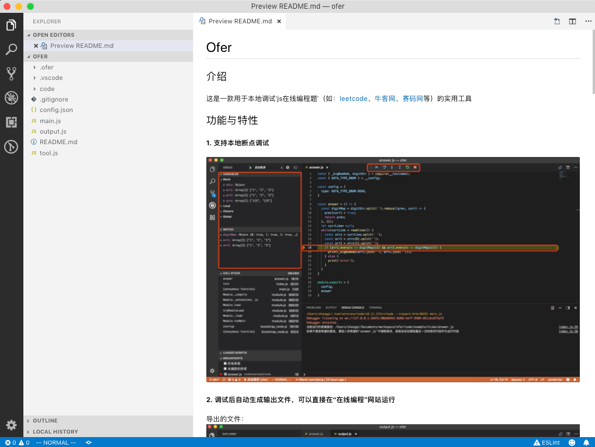
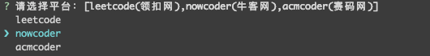
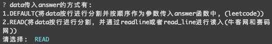
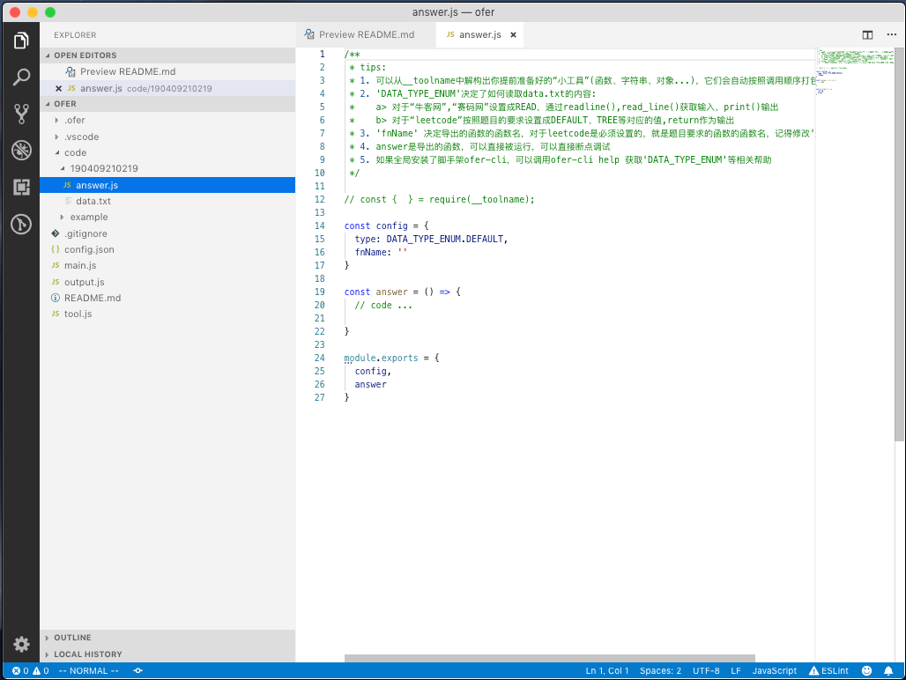
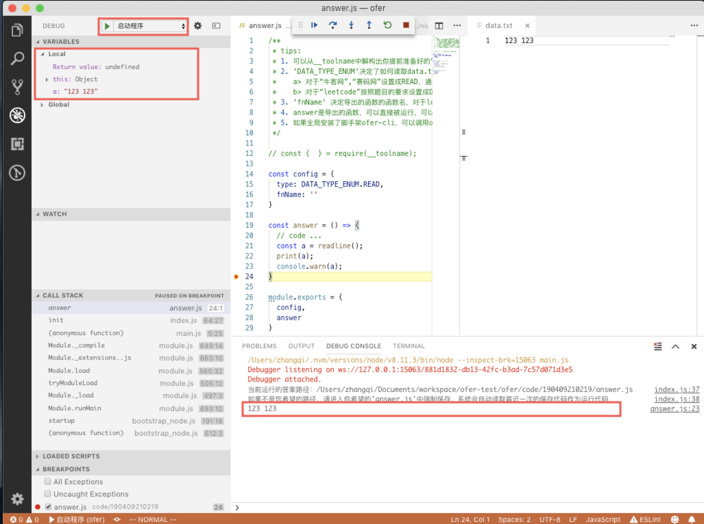

# ofer-cli
## ofer-cli 介绍
#### 这是用于搭建[ofer项目](https://github.com/tuanzijiang/ofer)的脚手架。本身是为了便于前端校招的同学做算法笔试题时，可以更加方便的调试代码。ofer从单词offer中衍生而来，寓意是希望大家多拿offer。

#### 本系统对三个平台进行支持：[leetcode](https://leetcode-cn.com/problemset/all/)、[牛客网](https://www.nowcoder.com/activity/oj)、[赛码网](http://www.acmcoder.com/index)

#### 本系统需要 [Visual Studio Code](https://code.visualstudio.com/)

## ofer 平台介绍
#### 1. 支持本地断点调试
#### 2. 调试后自动生成输出文件，可以直接在“在线编程”网站运行
#### 3. 会对答案中的特定依赖项按调用顺序进行合并打包
#### 4. 支持对题目进行管理
#### 5. 操作简单

## 安装
npm install -g ofer-cli

## 指令
### 1. ofer-cli init
下载ofer模版，并初始化项目

### 2. ofer-cli start
用于快速创建题目，以创建牛客网的题目为例。步骤如下
#### 1. 选择做题的平台

#### 2. 填写题目代号(不填则基于时间随机生成一个文件夹作为题目所在文件夹)

#### 3. 设置Data传入的方式(牛客网和赛码网选择READ)

#### 4. 查看生成的文件所在的位置

#### 5. 查看生成的文件(完整的一个题目可以参考example文件夹下的例子)

#### 6. 调试代码(在vs code中用debug工具直接运行，默认会运行最后保存的题目文件夹)

